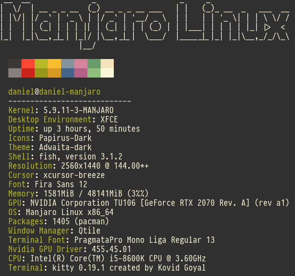

(WIP) Cppfetch
--------------

Displays system information. Similar to "neofetch".

**NOTE**: This is a work in progress project. It was only tested on Manjaro (Arch linux distro) and needs development.

- 3 times faster than neofetch.
- **Asynchronous** code that makes makes it run up to twice as fast.
- Short code base.

TODO:
-----
- Detect nvidia or amd graphics
- Detect shell
- Try on debian based systems and adapt the code to it.

Screenshot:
---------

